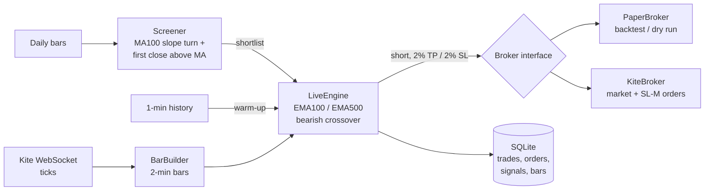

# Kite Connect Trading Bot

A two-stage intraday strategy on NSE stocks, built on Zerodha's [Kite Connect API](https://kite.trade/docs/connect/v3/): a daily screener shortlists stocks, a live engine streams prices and decides when to short them, and a broker layer lets the same code run as a backtest, a paper trade or a live order. Every signal, order and trade is logged to SQLite.



## Try it in 30 seconds (no broker account needed)

```bash
pip install -e ".[dev]"
python -m kite_bot demo        # screen -> backtest -> the same day through the live engine
pytest                         # 159 tests
```

The demo replays a synthetic day as ticks through the live engine and shows that it makes the same trades as the backtest.

## The strategy

**Stage 1, daily screen** (`screener/ma_cross.py`). A stock is shortlisted when its 100-day moving average has turned from rising to falling, and the close then crosses **above** that MA for the **first** time since the turn, on the last traded day. In a downtrend, that rally is treated as an exception to fade. `side="long"` gives the mirror image.

**Stage 2, intraday trigger** (`strategy/macd_short.py`, run live by `engine.py`). The next day, on 2-minute bars, the bot waits for EMA(100) to cross below EMA(500) (the MACD 100/500 line crossing zero), then shorts at the next bar's open. Exits are 2% take-profit, 2% stop-loss (both from the short price) and a forced square-off at 15:15. No new entries after 14:30, one trade per stock per day.

## Command line

```bash
python -m kite_bot demo [--write-data DIR]        # synthetic data, optionally saved as CSV
python -m kite_bot screen   --data-dir DIR        # who passes the daily screen
python -m kite_bot backtest --data-dir DIR [--start 2025-01-01 --end 2025-03-31 --capital 100000 \
                                            --commission 0.0003 --slippage 0.0005 --trades-csv trades.csv]
python -m kite_bot replay   --data-dir DIR [--date 2025-03-04 --db bot.db]   # live engine over one recorded day
python -m kite_bot report   --db bot.db [--day 2025-03-04]                   # trades and warnings from the database
python -m kite_bot download --symbols INFY TCS --data-dir DIR                # needs Kite login files
python -m kite_bot live --universe universe.txt --mode paper [--db bot.db]   # today, real data, simulated orders
python -m kite_bot live --universe universe.txt --mode live --capital 20000 \
                        --max-daily-loss 1000 --yes-real-money               # real orders
```

CSV format (one folder): `<SYMBOL>_day.csv` and `<SYMBOL>_1min.csv` with columns `date, open, high, low, close[, volume]`. A universe file is one NSE symbol per line.

## Live trading

The engine streams ticks from Kite's WebSocket, builds 2-minute bars itself (no per-bar REST polling), and places market orders plus an exchange-side stop-loss. It is built to fail safe: stops are cancelled before covering (with a check that avoids a double buy), unprotected positions are closed at once, a loss limit halts and flattens, and after a crash it reconciles the database with the broker. See **[docs/live-trading.md](docs/live-trading.md)** for the data flow, the Kite APIs used, the database tables, the safety rules, hosting requirements (static IP, data plan, daily token) and a suggested path from paper to real money. Example systemd files are in `deploy/`.

`KiteBroker`, `KiteTickerFeed` and `KiteMarketData` have only been run against fake clients, not the real service. Start with `--mode paper`, then one or two stocks with small limits.

## Design

Shared building blocks live in three modules, one job each, so nothing is copy-pasted between scripts:

| Module | Contains |
|---|---|
| `indicators.py` | `sma`, `ema`, `true_range`, `atr`, `bollinger_bands`, `macd`, `rsi`, `adx`, `supertrend`, `slope`, `pivot_levels`, `renko`, `renko_brick_size` |
| `patterns.py` | `doji`, `maru_bozu`, `hammer`, `shooting_star`, `trend`, `support_resistance`, `candle_type`, `candle_pattern` |
| `ohlc.py` | instrument lookup, `fetch_ohlc` (any interval and range, split into API-sized requests), `resample_ohlc`, `ticks_to_ohlc`, time-zone helpers, CSV load/save |

Built on top of them:

| Piece | Where | Notes |
|---|---|---|
| Screener | `screener/ma_cross.py` | Pure function: DataFrame in, `Setup` out |
| Strategy | `strategy/macd_short.py` | Crossover detection, entry rule, trade simulation |
| Broker interface | `broker/base.py` | `PaperBroker` (simulated fills, resting stops, P&L) and `KiteBroker` (live) implement it |
| Backtester | `backtest.py` | Replays history through screener, strategy and a broker |
| Live feed | `feed.py` | `Tick`, `BarBuilder`, `KiteTickerFeed` (WebSocket), `ReplayFeed` (offline) |
| Live engine | `engine.py` | Entries, stops, exits, kill switch, crash recovery |
| Database | `store.py` | SQLite: shortlist, signals, orders, trades, bars, events |
| Session runner | `live.py` | The daily routine: recover, screen, warm up, stream, wrap up |
| Settings | `config.py` | `StrategyConfig` (shared) and `LiveConfig` (safety limits) |
| Runner | `cli.py` | `python -m kite_bot ...` |
| Sample data | `sample_data.py` | Synthetic stocks for the demo and tests |

Because strategy code only sees the `Broker` interface and the engine only sees a `TickFeed`, the same logic runs against replayed data in tests and against Kite live, and the test suite needs no network or account. A test checks that the live engine, fed a day of replayed ticks, makes the same trades as the backtester.

The indicator and pattern functions are ports of the original scripts' formulas, checked against the originals on generated data (identical output), with the reference numbers frozen in `tests/test_indicators.py`. Two differences are deliberate: `candle_pattern` no longer raises when the price is beyond every pivot level, and `slope` returns 0 for a perfectly flat window instead of NaN.

```python
from kite_bot.indicators import atr, supertrend, macd
from kite_bot.patterns import candle_pattern
from kite_bot.ohlc import fetch_ohlc, load_instruments

instruments = load_instruments(kite)
bars = fetch_ohlc(kite, instruments, "INFY", "15minute", days=30)
print(supertrend(bars, 10, 3).iloc[-1], atr(bars, 14).iloc[-1])
```

## Setup for live data and orders

`download`, `live` and `KiteBroker` need a Kite Connect developer account. Create `api_key.txt` (first line: your API key) and `access_token.txt` (today's access token) in the folder you run from, or pass `--auth-dir`. Both are git-ignored, and the token expires daily. The legacy scripts below can generate the token. Order placement also needs a whitelisted static IP.

```bash
pip install -e ".[live]"       # kiteconnect: download command, live trading (use a recent release)
pip install -e ".[renko]"      # indicators.renko
```

## Background: the original scripts

The `kc_*.py`, `access_token*.py`, `three_supertrends*.py` and `renko_*.py` files in the repository root are the exploratory scripts this project started from, written while following a Udemy course on the Kite Connect API. They are standalone examples (login, historical data, indicators, candlestick patterns, order placement, streaming) and are not used by the `kite_bot` package. Their indicator, pattern and data-fetching code was merged into `indicators.py`, `patterns.py` and `ohlc.py`, so those root scripts now duplicate it. Each one works relative to its own folder and expects `api_key.txt` and `access_token.txt` next to it. `manual_connection.py`, `access_token.py` (needs a `chromedriver` file) and `access_token_ec2.py` generate the token.

## Security

Never commit `api_key.txt`, `access_token.txt`, `request_token.txt`, `key.txt`, `bot.db` or any `.pem` file. They are excluded by `.gitignore`. If credentials are ever committed, rotate them in the Kite developer console.

## Disclaimer

Educational code. Trading involves financial risk, and backtests on synthetic or historical data say nothing certain about future results.
