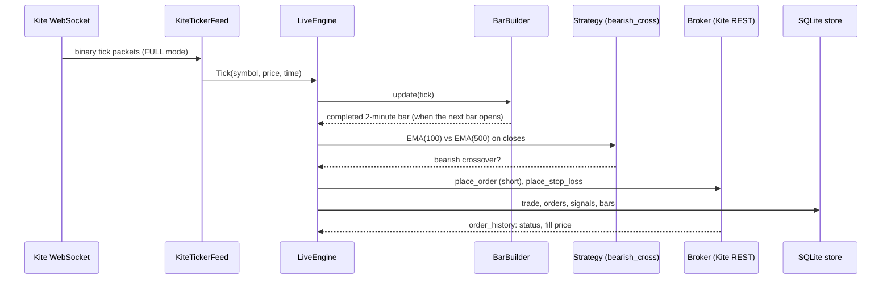

# Live trading: how it works and what it needs

This document covers the live layer (`feed.py`, `engine.py`, `store.py`, `live.py`, `broker/`).
Facts about Zerodha's rules were checked in September 2026 and change over time: confirm them
against the current Kite Connect documentation before relying on them.

## A day in the life

| Time (IST) | What happens | Kite calls |
|---|---|---|
| Before 09:00 | You produce today's `access_token.txt` (the token expires every day) | login flow |
| ~08:50 | `python -m kite_bot live ...` starts, reconciles state from the database | `positions`, `order_history` |
| Pre-market | Screen the universe on daily bars, keep the shortlist | `instruments` once, `historical_data` (day) per stock |
| Pre-market | Load recent 1-minute history for each shortlisted stock (warm-up for the 500-bar EMA) | `historical_data` (minute) per shortlisted stock |
| 09:15 onward | Ticks stream in, the engine builds 2-minute bars and watches for crossovers | WebSocket only |
| On a signal | Sell short, confirm the fill, place an exchange-side stop-loss | `place_order`, `order_history`, `place_order` (SL-M) |
| Any time | Take-profit / stop-loss / time exit: cancel the stop, cover | `cancel_order`, `place_order`, `order_history` |
| 15:15 | Square off anything still open | same |
| 15:31 | Save bars, flatten leftovers, print the summary, exit | |

## How data reaches the bot



* **Prices are streamed, not polled.** Kite pushes ticks over one WebSocket connection (up to 3000
  instruments per connection, 3 connections per API key). The `KiteTicker` client decodes them on its own thread.
  The original scripts polled the REST API for candles every few minutes; that used a request per stock per
  cycle against a rate limit of about 3 historical-data requests per second. Streaming avoids it.
* **FULL mode** is used because it is the only mode whose packets include the exchange timestamp.
* **Bars are built locally.** `BarBuilder` groups ticks into 2-minute bars anchored at 09:15, exactly like
  `resample_ohlc` does for history, so warm-up bars (from REST) and live bars (from ticks) line up. A test checks that
  bars rebuilt from replayed ticks equal the historical resample.
* **A bar is completed by the first tick of the next bar.** That tick's price is the next bar's open, which is
  the entry price the backtester assumes, so backtest and live entries agree.
* **Time zones.** The Kite ticker library stamps ticks in the machine's local timezone, which is wrong on a UTC
  server. `to_ist_naive` converts every tick to India time, and `ist_now()` is used instead of `datetime.now()`.
* **If the connection drops,** KiteTicker reconnects by itself. If it gives up, the engine halts new entries; open
  positions keep their exchange-side stop and are still closed at 15:15 by the clock.

## Orders

* Entry and exit are **market orders with `market_protection`**. The API rejects plain market orders, and `-1`
  asks Kite to choose the protection band. You need a recent `kiteconnect` release that accepts the argument.
* The stop-loss is an **SL-M order resting at the exchange**, placed right after the entry fills. It protects you
  if the bot, the server or the network dies. Trigger prices are rounded to the instrument's tick size.
* The **take-profit and time exit are software**: the engine sees the price cross and sends a market order.
* Orders carry the tag `kitebot`, so you can find them in the order book.
* Unregistered client-side algos are limited to 10 orders per second by the exchange framework. This bot places a
  handful of orders per day.

## Safety rules the engine follows

1. The trade is written to the database **before** its stop-loss is placed, so a crash in between is repaired on restart.
2. Every entry gets a stop-loss. If it cannot be placed, the position is closed at once.
3. Before covering, the resting stop is cancelled. If the cancel fails, the stop's status is checked: if it has
   already executed, the engine does **not** buy again (that would leave you long). If it cannot tell, it does not cover and halts.
4. A position that cannot be closed after 3 attempts halts the engine, restores the stop and logs a CRITICAL event.
5. Kill switches: `--max-daily-loss` (net of realized and open P&L; halts and flattens), `engine.halt()`, and a halt
   stored in the database survives restarts. A halt blocks new entries only; exits continue.
6. One trade per stock per day, at most `--max-trades` per day, no entries after 14:30, everything closed by 15:15.
7. On start-up `recover()` compares the database with the broker: it resumes matching positions, finds stops that
   fired while the bot was down, replaces missing stops, and halts on any mismatch or unknown position.
8. An error while handling a tick is logged to the database and never stops the stream.

## The database

One SQLite file (`bot.db` by default). Open it with `sqlite3 bot.db` or `python -m kite_bot report --db bot.db`.

| Table | Contents |
|---|---|
| `shortlist` | stocks that passed the daily screen, per day |
| `signals` | every crossover and what happened: `entered`, `skipped` (with the reason), `exited: <reason>` |
| `orders` | every order sent: id, side, quantity, price, purpose (`entry`, `stop`, `exit`) |
| `trades` | one row per position: entry, target, stop, stop order id, exit, reason, P&L, status |
| `bars` | completed 2-minute bars built from the tick stream |
| `ticks` | raw ticks (only with `--record-ticks`; large) |
| `events` | warnings, halts, recoveries, errors |
| `kv` | small state such as the kill switch |

```sql
SELECT symbol, entry_price, exit_price, exit_reason, ROUND(pnl, 2) FROM trades WHERE day = '2026-10-01';
SELECT ts, symbol, action, detail FROM signals WHERE action = 'skipped';
SELECT * FROM events WHERE level IN ('WARNING', 'CRITICAL', 'ERROR');
```

## What you need to run it for real

1. **A Kite Connect app** and the paid **Connect plan** (₹500/month per API key at the time of writing). The free
   Personal plan has no streaming or historical data.
2. **A whitelisted static IP** for order placement (required since 1 April 2026). Streaming and read-only calls work
   from any IP. The IP must match exactly, can be changed only once per calendar week, and may only be shared with
   immediate family. A home connection usually has a changing IP, so most people use a small cloud server.
3. **A daily access token.** It expires every day and the login needs two-factor authentication. The scripts in the
   repository root show one way to produce `access_token.txt`; check Zerodha's terms before automating a login.
4. **A server that stays up** during market hours, with correct time (NTP), the bot run by a supervisor
   (see `deploy/`), and `api_key.txt` / `access_token.txt` kept outside the repository.
5. **A way to notice problems.** There are no alerts yet; check `python -m kite_bot report --db bot.db` daily,
   and read `events`.

## Suggested path to real money

1. `python -m kite_bot demo` and `pytest`: everything works offline.
2. `download` real history for a few stocks, then `backtest` and `replay` it. Compare the two: they should agree.
3. `live --mode paper` for several weeks: real streaming data, simulated orders, full logging. Read the `signals` and
   `events` tables. Paper mode keeps its positions in memory only, so do not restart it mid-day.
4. `live --mode live --capital <small> --max-daily-loss <small> --yes-real-money` with one or two stocks, for a
   few days. Confirm in the Kite order book that entries, stops and exits look as the database says.
5. Increase size slowly. Decide in advance what loss makes you stop.

## Not built yet

* **Margin and short-selling checks.** Not every stock can be shorted intraday, and margin is not checked. A rejected entry is logged and skipped.
* **Costs.** Brokerage, STT and other charges are not modelled in live reporting (the backtester and paper broker can add commission and slippage).
* **Market holidays, circuit limits, F&O ban lists.** On a holiday no ticks arrive and the session simply ends without trades.
* **Alerts** (email, Telegram) and a dashboard.
* **Partial fills on entry** are accepted as filled; only the filled quantity is protected and managed.
* **Live testing.** `KiteBroker`, `KiteTickerFeed` and `KiteMarketData` have only been run against fake clients.
  Treat the first live days as testing.
